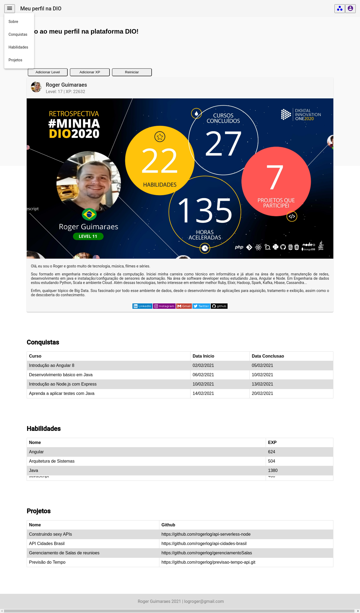

# Spaangular

- Projeto/Desafio do Bootcamp da Avanade proposto por [Camila Ferreira Ribeiro](https://github.com/cahferreira93).
- Foi desenvolvido uma página única com informações do usuário oriundas da plataforma [DIO](https://digitalinnovation.one) .

- O link de acesso para a página está no [Netlify](https://www.netlify.com/) com o seguinte endereço: 

https://spaangular-roger.netlify.app

- O vídeo de desenvolvimento do projeto está no endereço:

https://youtu.be/Kuc5uzn-ACI

- Uma prévia da página:



*Obs: Este projeto foi desenvolvido com [Angular CLI](https://github.com/angular/angular-cli) version 11.2.1.*


<hr>


### Desenvolvimento

<br>

**Criando nossos componentes**

```bash
ng g c home
ng g c sobre
ng g c Conquistas
ng g c Habilidades
ng g c Projetos
```

Obs: Sempre que adicionamos um componente ao nosso projeto, precisamos adicioná-lo ao arquivo **app.module.ts** que fica em `/src/app/app.module.ts`

**Definindo nosso home como inicial e nossas rotas**

No arquivo `app-routing.module.ts` vamos adicionar na constante de Rotas o caminho e qual componente esta associado. Vai ficar assim:

```typescript
const routes: Routes = [
  {
    path: '',
    component: HomeComponent
  },
  {
    path: 'conquistas',
    component: ConquistasComponent
  },
  {
    path: 'habilidades',
    component: HabilidadesComponent
  },
  {
    path: 'projetos',
    component: ProjetosComponent
  },
  {
    path: 'sobre',
    component: SobreComponent
  }
];
```

Por padrão, no arquivo `app.component.html ` já vem preenchido com toda a configuração inicial da nossa aplicação criada. Vamos precisar excluir este conteúdo e deixar apenas o router-outlet

```html
<router-outlet></router-outlet>
```

<br>

**Importando o Angular Material**

[Link do Angular Material](https://material.angular.io/)

Para utilizarmos os componentes do Angular Material, precisamos adicioná-lo em nosso projeto

```bash
ng add @angular/material
```

<br>

**Adicionando componentes do Angular Material**

Acessar https://material.angular.io/components/categories

Vamos escolher um componente e adicionar o import no nosso `app.module.ts`

Nossas importações do angular material no `app.module.ts`

```typescript
import { MatToolbarModule } from '@angular/material/toolbar';
import { MatIconModule } from '@angular/material/icon';
import { MatMenuModule } from '@angular/material/menu';
import { MatTabsModule } from '@angular/material/tabs';
import { MatTableModule } from '@angular/material/table';
import { MatCardModule } from '@angular/material/card';
```

Nosso `@NgModule` com os `declarations` e `imports`

```typescript
@NgModule({
  declarations: [
    AppComponent,
    HomeComponent,
    SobreComponent,
    ConquistasComponent,
    HabilidadesComponent,
    ProjetosComponent
  ],
  imports: [
    BrowserModule,
    AppRoutingModule,
    BrowserAnimationsModule,
    MatToolbarModule,
    MatIconModule,
    MatMenuModule,
    MatTabsModule,
    MatTableModule,
    MatCardModule
  ],
  providers: [],
  bootstrap: [AppComponent]
})
```

Após a importação do componente, vamos copiar o html e colar no arquivo `home.component.html`

```html
<mat-toolbar>
  <button mat-icon-button class="example-icon" aria-label="Example icon-button with menu icon">
    <mat-icon>menu</mat-icon>
  </button>
  <span>My App</span>
  <span class="example-spacer"></span>
  <button mat-icon-button class="example-icon favorite-icon" aria-label="Example icon-button with heart icon">
    <mat-icon>favorite</mat-icon>
  </button>
  <button mat-icon-button class="example-icon" aria-label="Example icon-button with share icon">
    <mat-icon>share</mat-icon>
  </button>
</mat-toolbar>
```

Copiar o CSS e colar em `home.component.css`

```css
.example-spacer {
  flex: 1 1 auto;
}
```

<br>

**As interações na página**

- **Interpolação**: {{valor}}

No arquivo `/src/app/sobre/sobre.component.html`

```html
 <mat-card-header>
        <div mat-card-avatar class="example-header-image"></div>
        <mat-card-title>Roger Guimaraes</mat-card-title>
        <mat-card-subtitle>Level: {{levelInicial}} | XP: {{xpInicial}}</mat-card-subtitle>
</mat-card-header>
```

- **Property Binding**: [propriedade]="valor"

No arquivo `/src/app/home/home.component.html` os valores do *xp* e *level*.

```html
<div *ngIf="exibeSobre">
        <button class="btnAlterar" (click)="addLevel()">Adicionar Level</button>
        <button class="btnAlterar" (click)="addXp()">Adicionar XP</button>
        <button class="btnAlterar" (click)="reiniciar()">Reiniciar</button>
        <spa-sobre [xpInicial]="xp" [levelInicial]="level"></spa-sobre
</div>
```

- **Input Property:**

No arquivo `/src/app/sobre/sobre.component.ts`

```typescript
 @Input() xpInicial: number = 1;
 @Input() levelInicial: number = 1;
```

<br>

**Inserindo o projeto no Netlify**

Na página inicial do Netlify, clique em adicionar projeto do github.

*Obs: Na área de deploy adicionar os seguintes comandos e diretórios*

- *Build command:*	ng build

- *Publish directory:*	dist/spaangular

Para modificar o endereço padrão:

Em `Site settings`, na aba de `Domain management`, ao lado do endereço padrão da sua aplicação clique em `Options` e `Edit site name`

<br>

**Alguns links que me ajudaram na criação da página**

- [Gerador de Botão CSS](https://www.bestcssbuttongenerator.com/)
- [Icones do menu](https://material.io/resources/icons/?icon=workspaces&style=baseline)
- [Angular Material](https://material.angular.io)
- [Netlify](https://app.netlify.com)

